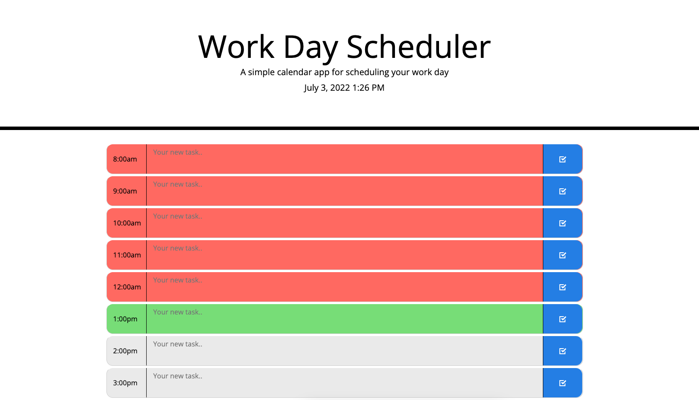

# Work Day Scheduler

## Purpose
This Work Day Scheduler is designed for users to be able to organize their day for a typical 8am-5pm work day. Users may enter their desired task for each time slot and click the check button to the right to save their task for that time slot. Each time row will change color based on the current time of day for that specific user. The current time slot will show green for that hour, any time slot that has passed and is behind the current hour will turn red, and any fuuture time slots that are ahead of the current hour will show grey.

## Link to Work Day Scheduler
Link: https://cortlandfinch.github.io/project-secretary/

